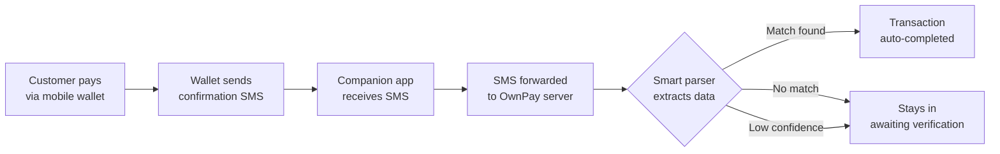

SMS auto-verification lets OwnPay confirm manual payments without you lifting a finger. When a customer pays via a mobile wallet or bank, the payment confirmation SMS is forwarded to OwnPay, parsed, and matched to the pending transaction.

## How it works

1. The customer completes a payment and submits the transaction ID at checkout.
2. The wallet provider sends a confirmation SMS to the phone running the companion app.
3. The companion app forwards the SMS to your OwnPay server.
4. The smart parser extracts the **amount** and **transaction ID** from the SMS text.
5. OwnPay matches the extracted data against pending transactions.
6. If the amount and transaction ID match with sufficient confidence, the transaction is automatically completed.

## Prerequisites

Before setting up SMS verification, you need:

- The **OwnPay companion app** installed on an Android phone — see [Companion app](/mobile/companion-app).
- The device **paired** with your OwnPay server — see [Paired devices](/mobile/devices).
- SMS forwarding **enabled** in the companion app settings.
- At least one manual gateway with **Enable SMS Verification** turned on.

## Smart parser

The smart parser extracts payment data from SMS messages using a combination of regex patterns and heuristic rules. It does not require an external AI service.

- **Regex templates** — you define patterns per gateway under [SMS templates](/mobile/sms-templates). Each template specifies how to extract amount, transaction ID, and sender.
- **Heuristic rules** — when no template matches, the parser uses built-in rules to identify common SMS formats (e.g. "Tk 500 received from...").
- **Confidence scoring** — each parse result gets a confidence score. Only matches above the threshold are auto-completed. Low-confidence matches stay in awaiting-verification for manual review.

## Supported gateways

| Gateway | SMS parsing | Template provided | Notes |
|---|---|---|---|
| **bKash** | Yes | Yes | Well-tested, high confidence |
| **Nagad** | Yes | Yes | Well-tested, high confidence |
| **Rocket** | Yes | Yes | Template included |
| **Upay** | Yes | Yes | Template included |
| **Bank transfer (generic)** | Partial | No | Requires custom template |

For gateways not listed, you can create a custom SMS template — see [SMS templates](/mobile/sms-templates).

## Troubleshooting

| Problem | Cause | Solution |
|---|---|---|
| Transactions not auto-completing | Companion app offline or SMS forwarding disabled | Check the device status on the Paired Devices page |
| Wrong amount extracted | Regex template does not match the SMS format | Edit the SMS template and test with a sample message |
| Match found but confidence too low | SMS format changed after a gateway update | Update the regex template to match the new format |
| Duplicate SMS causing double-match | Same SMS forwarded multiple times | The system deduplicates by transaction ID; if issues persist, check the companion app settings |

## Related Pages

- [SMS templates](/mobile/sms-templates) — create and manage parsing templates
- [Companion app](/mobile/companion-app) — install and configure the Android app
- [Paired devices](/mobile/devices) — pair your phone with the server
- [Manual methods](/gateways/manual-methods) — create manual gateways with SMS verification enabled
